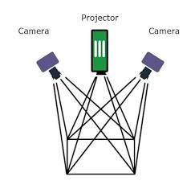
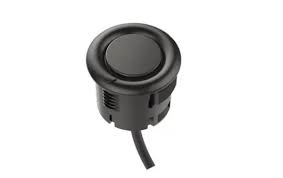
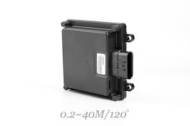

# Week5实验报告

## 任务 1 —— FR_mid 车辆核心硬件与紧急制动

### 1. FR_mid 车辆紧急制动按钮

- 按钮位置：FR_mid 车辆的紧急制动按钮（大红按钮）通常位于车辆后部的显眼位置，或者在车辆侧方的控制面板上，确保在紧急情况下操作者可以快速触及。
- 如何进行紧急制动：当发生紧急情况（如车辆失控、前方突然出现障碍物或程序运行异常）时，用手掌用力按下该红色蘑菇头按钮。按下后，车辆会立即切断动力输出并强制执行制动动作。
- 如何解除紧急制动：观察红色按钮顶部的箭头标识，按照箭头指示方向（通常为顺时针方向）旋转按钮。按钮会自动向上弹起，此时车辆的硬件保护状态解除，可以重新上电启动。

### 2. 核心传感器工作原理及作用

- LiDAR（激光雷达）
    - 工作原理：通过发射激光束并接收从物体表面反射回来的光信号，利用飞行时间（ToF）计算距离。旋转的激光雷达可以获取 360 度的环境信息。
    - 车辆作用：为车辆提供高精度的三维环境点云数据，用于障碍物检测、边界识别以及辅助高精度定位。
- GNSS/IMU（组合导航系统）
    - 工作原理：GNSS 利用卫星信号确定车辆的经纬度位置；IMU（惯性测量单元）通过加速度计和陀螺仪测量车辆的角速度和加速度。
    - 车辆作用：两者协同工作（通过 Kalman 滤波算法融合）。GNSS 提供长期的绝对位置，IMU 提供高频的姿态信息。在隧道或树荫等卫星信号弱的地方，IMU 能短时间维持定位精度。
- 感知摄像头
    - 工作原理：利用光学成像原理获取图像信息，通过计算机视觉算法（如深度学习）对图像中的物体进行分类和特征提取。
    - 车辆作用：主要用于识别车道线、交通标志（限速、红绿灯）以及分辨行人和车辆的类别。
    
    
    
- 超声波雷达
    - 工作原理：发射超声波脉冲，通过测量声波往返的时间来计算距离。
    - 车辆作用：主要用于近距离避障（0.2米-5米范围内），在自动泊车和低速行驶时检测侧方和后方的近处障碍物。
    
    
    
- 毫米波雷达
    - 工作原理：发射毫米波段的电磁波，利用多普勒效应测量目标的相对速度和距离。
    - 车辆作用：具备极强的穿透力，能在雨、雪、雾等恶劣天气下稳定工作，主要用于前向或后向的远距离车辆监测（ACC自适应巡航的核心传感器）。
    
    
    

### 3. 车辆防撞条位置

- FR_mid 车辆的防撞条通常安装在车辆的最前端和最后端。其内部集成了触碰式传感器，当防撞条受到物理挤压时，会自动触发紧急停车指令，作为传感器失效后的最后一层硬件保护。

---

## 任务二 填写映射表

| **模块名称** | **核心功能** | **代码路径 (在 apollo 项目下)** |
| --- | --- | --- |
| **Perception** | 感知周围障碍物、车道线、交通灯 | modules/perception |
| **Localization** | 提供车辆的高精度地理位置 | modules/localization |
| **Map** | 提供高精地图数据支持 | modules/map |
| **Prediction** | 预测障碍物（如行人、他车）的未来轨迹 | modules/prediction |
| **Routing** | 类似手机导航，规划从 A 点到 B 点的全局路径 | modules/routing |
| **Planning** | 局部路径规划，决定当前怎么走（避障、变道） | modules/planning |
| **Control** | 向车辆发送转向、刹车、加速指令 | modules/control |
| **Canbus** | 与车辆底盘通信，读取状态并反馈指令 | modules/canbus |
| **HMI** | 人机交互界面，显示车辆运行状态 | modules/dreamview |
| **Monitor** | 监控系统各模块健康状态 | modules/monitor |
| **Guardian** | 安全守护，检测到异常时强制停车 | modules/guardian |

---

## 总结 Checklist（完成标志）：

- 我是否知道了紧急制动按钮怎么按、怎么拔？（是）
- 我是否拍了传感器照片并写了原理？（是）
- 我是否完成了 11 个主要模块的路径表格？（是）